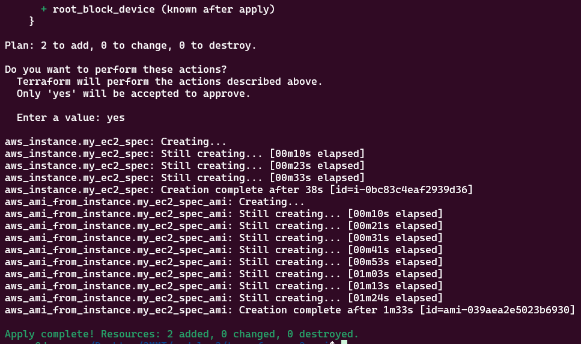
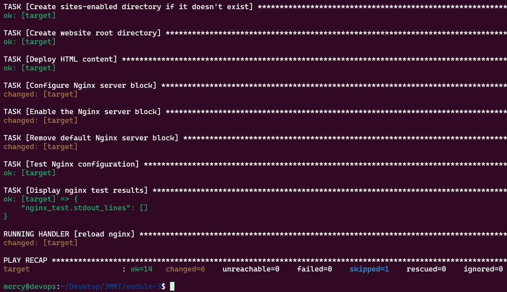
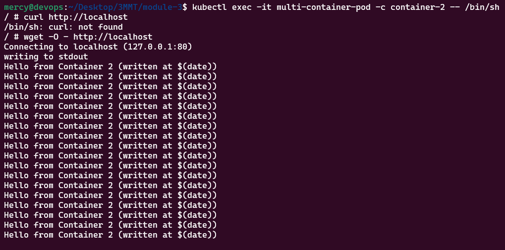
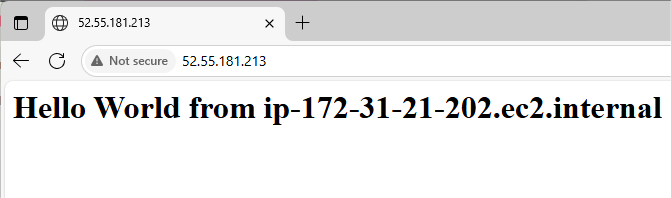

# Setting up Minikube

This README provides a comprehensive guide for setting up Minikube on a Linux system for local Kubernetes development and learning.

## What is Kubernetes?

Kubernetes (often shortened to "K8s") is an open-source container orchestration platform that automates the deployment, management, scaling, and operation of containerized applications. Think of Kubernetes as a smart manager for your applications. Just like a restaurant manager coordinates multiple waiters, chefs, and tables to serve customers efficiently,

## key components of Kubernetes:

- **API Server**: The front-end for the Kubernetes control plane, handling all communication.
- **etcd**: A distributed key-value store that holds all cluster data and configuration.
- **Scheduler**: Assigns pods to nodes based on resource availability and constraints.
- **Controller Manager**: Runs controllers to regulate the state of the cluster (e.g., replication, node lifecycle).
- **Kubelet**: An agent on each node that ensures containers are running as expected.
- **Kube-Proxy**: Manages network rules on nodes to enable communication between pods.
- **Container Runtime**: Software (e.g., Docker) that runs containers on nodes.
- **Pods**: The smallest deployable units, containing one or more containers.
- **Nodes**: Worker machines (virtual or physical) that run pods.
- **Deployments**: Manage pod replication and updates.
- **Services**: Provide networking and load balancing for pods.

## Overview

This project focuses on setting up Minikube for Container Orchestration with Kubernetes on Windows, Linux and Mac System. Minikube provides a local Kubernetes environment that's perfect for development, testing, and learning Kubernetes concepts without the complexity of a full production cluster.

## Project Prerequisites

Before starting this setup, ensure you have:
  - Completion of foundations core program 1 & 2 projects
  - 2 CPUs or more
  - 2GB of free memory
  - 20GB of free disk space

## Project Goals

By completing this setup, you will have:

- Gained a comprehensive understanding of Kubernetes and its fundamental concepts
- Mastered the usage of Minikube for local Kubernetes cluster deployment and experimentation
- Acquired hands-on experience with Docker and containerization principles
- A functional local Kubernetes environment ready for application deployment and testing

## What is Minikube?

Minikube is an open-source tool that enables you to run Kubernetes clusters locally on your machine. It creates a single-node Kubernetes cluster inside a virtual machine, providing a user-friendly playground for safely building and testing applications before production deployment.

## Getting Started With Minikube

## Installing Minikube on Windows
To install minikube on Windows, we need to use Chocolatey. Chocolatey, just like linux "apt" and "yum", is a windows package manager for installing, updating and removing software packages on windows.

### Step 1:
Go to the windows search bar and launch a terminal with administrative access



### Step 2: Install Minikube
`choco install minikube`



Note: If you don't have chocolatey installed, follow the official documentation to install it.

### Step 3: 
Minikube needs docker as a driver and also to pull its base image, therefore we need to install docker desktop for windows.

Go to docker desktop official documentation to install it if not installed

### Step 4: Run the command below to start minikube using docker as the driver
`minikube start --driver=docker`



## Installing Minikube on Linux

### Step 1: Update System Packages

First, refresh your package list to ensure you have access to the latest software versions:

```bash
sudo apt-get update
```

This command updates the package index on your Debian-based system.

### Step 2: Install Docker

Minikube requires Docker as a driver and for pulling base images. Follow these steps to install Docker:

#### 2.1 Install Prerequisites

```bash
sudo apt-get install ca-certificates curl gnupg
```

This installs essential packages including certificate authorities, curl for data transfer, and GNU Privacy Guard for secure communication.

#### 2.2 Set up Docker GPG Key

Create a directory for Docker keyrings:

```bash
sudo install -m 0755 -d /etc/apt/keyrings
```

Download and add Docker's official GPG key:

```bash
curl -fsSL https://download.docker.com/linux/ubuntu/gpg | sudo gpg --dearmor -o /etc/apt/keyrings/docker.gpg
```

Set appropriate permissions:

```bash
sudo chmod -R /etc/apt/keyrings/docker.gpg
```

#### 2.3 Add Docker Repository

Add Docker's APT repository to your system:

```bash
echo \
  "deb [arch=$(dpkg --print-architecture) signed-by=/etc/apt/keyrings/docker.gpg] https://download.docker.com/linux/ubuntu \
  $(. /etc/os-release && echo "$VERSION_CODENAME") stable" | \
  sudo tee /etc/apt/sources.list.d/docker.list > /dev/null
```

Update package index again:

```bash
sudo apt-get update
```

#### 2.4 Install Docker Engine

```bash
sudo apt-get install docker-ce docker-ce-cli containerd.io docker-buildx-plugin docker-compose-plugin
```

#### 2.5 Verify Docker Installation

Check that Docker is running properly:

```bash
sudo systemctl status docker
```

### Step 3: Install Minikube

#### 3.1 Download Minikube

Download the latest Minikube .deb package:

```bash
curl -LO https://storage.googleapis.com/minikube/releases/latest/minikube_latest_amd64.deb
```

> **Note:** If you encounter errors during download, reach out to technical support.

#### 3.2 Install Minikube

Install the downloaded package using dpkg:

```bash
sudo dpkg -i minikube_latest_amd64.deb
```

**Expected Output:**
```
(Reading database ... 63745 files and directories currently installed.)
Preparing to unpack minikube_latest_amd64.deb ...
Unpacking minikube (1.32.0-0) ...
Setting up minikube (1.32.0-0) ...
```

### Step 4: Start Minikube

Start your Minikube cluster using Docker as the driver:

```bash
minikube start --driver=docker
```


**Expected Startup Process:**
```
🏃 Booting up control plane ...
🤖 Configuring RBAC rules ...
🔗 Configuring bridge CNI (Container Networking Interface) ...
📦 Using image gcr.io/k8s-minikube/storage-provisioner:v5
🔎 Verifying Kubernetes components ...
🌟 Enabled addons: default-storageclass, storage-provisioner
💡 kubectl not found. If you need it, try: 'minikube kubectl -- get pods -A'
🏁 Done! kubectl is now configured to use "minikube" cluster and "default" namespace by default
```

### Step 5: Install kubectl

kubectl is the command-line interface for interacting with Kubernetes clusters:

```bash
sudo snap install kubectl --classic
```

**Expected Output:**
```bash
kubectl 1.28.5 from Canonical/ installed
```

## Verification

Verify your installation by checking the cluster status:

```bash
kubectl cluster-info
```
Check that all system pods are running:

```bash
kubectl get pods -A
```
**Expected Result**
```bash
kubectl get pods -n kube-system | grep metrics-server
metrics-server-7fbb699795-xnx2r    1/1     Running   0             15m
kubectl top nodes
NAME       CPU(cores)   CPU(%)   MEMORY(bytes)   MEMORY(%)
minikube   232m         2%       1104Mi          28%
```
Verify Minikube status:

```bash
minikube status
```
**Expected output**
```bash
minikube status
minikube
type: Control Plane
host: Running
kubelet: Running
apiserver: Running
kubeconfig: Configured
```

## Next Steps

Now that you have Minikube running, you can:

1. **Deploy your first application:**
   ```bash
   kubectl create deployment hello-minikube --image=gcr.io/google_containers/echoserver:1.4
   ```

2. **Expose the application:**
   ```bash
   kubectl expose deployment hello-minikube --type=NodePort --port=8080
   ```

  **Expected output**
  ```bash
  kubectl expose deployment hello-minikube --type=NodePort --port=8080
  Error from server (AlreadyExists): services "hello-minikube" already exists
  ```

3. **Access the Minikube dashboard:**
   ```bash
   minikube dashboard
   ```
**Expected Output**


4. **Practice Kubernetes concepts:**
   - Create and manage pods
   - Work with services and deployments
   - Explore ConfigMaps and Secrets
   - Practice scaling applications

## Troubleshooting

### Common Issues and Solutions

**1. Docker Permission Denied:**
```bash
sudo usermod -aG docker $USER
newgrp docker
```

**2. Minikube Won't Start:**
```bash
minikube delete
minikube start --driver=docker --force
```

**3. Check Minikube Logs:**
```bash
minikube logs
```

**4. Reset Minikube:**
```bash
minikube stop
minikube delete --all
minikube start --driver=docker
```

### Useful Commands

- **Stop Minikube:** `minikube stop`
- **Delete Minikube:** `minikube delete`
- **Get Minikube IP:** `minikube ip`
- **SSH into Minikube:** `minikube ssh`
- **Open Dashboard:** `minikube dashboard`

## Installing Minikube on Mac

For mac users, let's install minikube

### Step 1: Launch a terminal with administrative access

### Step 2: Download Minikube
```bash
curl -LO https://storage.googleapis.com/minikube/releases/latest/minikube-darwin-amd64
```

### Step 3: Install Minikube
```bash
sudo install minikube-darwin-amd64 /usr/local/bin/minikube
```

The command above downloads minikube's binary and install minikube.

### Step 4: Install Docker
Just like windows and linux, we need docker desktop as a driver for minikube. TO install docker desktop for mac go to docker desktop official documentation to install it if not installed

### Step 5: Start Minikube
Run the command below to start minikube using virtualbox as the driver
bash
```bash
minikube start --driver=docker
```
## Conclusion

You now have a fully functional local Kubernetes environment using Minikube on your Windows, Linux and Mac OS systems.This setup provides an e xcellent foundation for learning Kubernetes concepts with great refernce to the Linux Operating System.
---