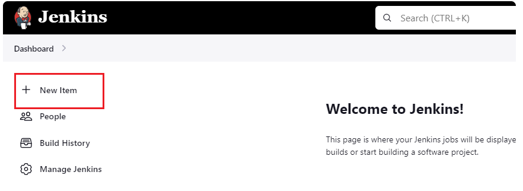
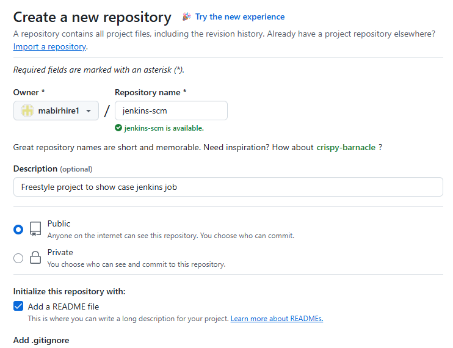
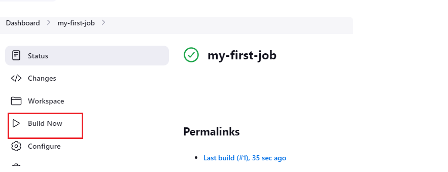
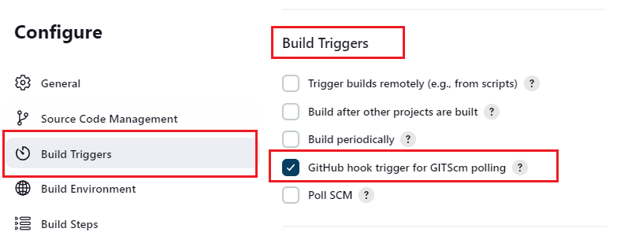

# Jenkins CI/CD Learning Path

## Introduction to CI/CD

**Continuous Integration and Continuous Delivery (CI/CD)** are best practices that automate the software development lifecycle. CI/CD enhances efficiency, stability, and deployment speed by enabling frequent code integration, automated testing, and reliable deployment pipelines.

---

## What is Jenkins?

**Jenkins** is an open-source automation server that automates building, testing, and deploying applications. It supports pipelines to define entire workflows, integrates with version control systems for automatic builds, and offers an extensive plugin ecosystem for customization.

---

## Installation Guide

### Prerequisites

- Completed foundational programs 1-3
- System with JDK installed

### Installation Steps

1. **Update package repositories:**
    ```bash
    sudo apt-get update
    ```

2. **Install JDK:**
    ```bash
    sudo apt-get install default-jdk
    ```

3. **Add Jenkins repository and install:**
    ```bash
    sudo wget -O /usr/share/keyrings/jenkins-keyring.asc \
      https://pkg.jenkins.io/debian-stable/jenkins.io-2023.key
    echo "deb [signed-by=/usr/share/keyrings/jenkins-keyring.asc]" \
      https://pkg.jenkins.io/debian-stable binary/ | sudo tee \
      /etc/apt/sources.list.d/jenkins.list > /dev/null
    sudo apt-get update
    sudo apt-get install jenkins
    ```

4. **Verify installation:**
    ```bash
    sudo systemctl status jenkins
    ```


5. **Create Inbound rules for security group:**


6. **Access Jenkins web console:**
    ```
    http://<public-ip>:8080
    ```

7. **Retrieve initial admin password:**
    ```bash
    sudo cat /var/lib/jenkins/secrets/initialAdminPassword
    ```


---

## Project Goals

By completing this learning path, you will:

- Understand CI/CD principles and their benefits
- Install and configure Jenkins
- Create and manage Jenkins jobs
- Automate software builds and tests
- Implement deployment pipelines
- Integrate with version control systems

---

## Getting Started with Jenkins

### Initial Setup

1. **Install required plugins:**
    - Navigate to **Manage Jenkins > Plugins**
    - Install suggested plugins or select specific ones


2. **Create admin user:**
    - Set up credentials after initial login


3. **Configure security:**
    - Set up appropriate security groups
    - Ensure port 8080 is accessible

---


### Basic Operations

- **Create your first job:**
    - Go to **New Item > Enter name > Select "Freestyle project"**
    - Configure source code management (Git, SVN)
    - Set build triggers
    - Add build steps (shell commands, etc.)

- **Pipeline creation:**
    - Define a `Jenkinsfile` with stages
    - Configure build, test, and deploy steps

---

## Common Tasks Checklist

- [ ] Install Jenkins
- [ ] Configure security settings
- [ ] Install necessary plugins
- [ ] Create admin user account
- [ ] Connect to version control
- [ ] Create first build job
- [ ] Test pipeline execution
- [ ] Configure deployment steps

---

## Troubleshooting

- **Port conflicts:** Change Jenkins port in `/etc/default/jenkins`
- **Connection issues:** Verify security group rules
- **Plugin errors:** Check compatibility and versions
- **Build failures:** Review console output for error

## Freestyle Project

Jenkins Freestyle Project

Jenkins Job

In Jenkins, a job is a unit of work or a task that can be executed by the Jenkins automation server.

A Jenkins job represents a specific task or set of tasks that needs to be performed as part of a build or deployment process. Jobs in Jenkins are created to automate the execution of various steps such as compiling code, running tests, packaging applications, and deploying them to servers. Each Jenkins job is configured with a series of build steps, post-build actions, and other settings that define how the job should be executed.

Creating a Freestyle Project

Let's create our first build job

i. From the dashboard menu on the left side, click on new item



ii. Create a freestyle project and name it "my-first-job"

[Alt text](https://www.google.com/search?q=https://darey-io-pbl-projects-images-latest.s3.eu-west-2.amazonaws.com/cicd-with-jenkins/jenkins-freestyle.PNG)

**Connecting Jenkins To Our Source Code Management**

Now that we have created a freestyle project, let connect jenkins with github.

i. Create a new github repository called jenkins-scm with a README.md file



ii. Connect `jenkins` to `jenkins-scm` repository by pasting the repository url in the area selected below. Make sure your current branch is `main`



We have successfully connected jenkins with our github repository (jenkins-scm)

**Configuring Build Trigger**

As an engineer, we need to be able to automate things and make our work easier in possible ways. We have connected `jenkins` to `jenkins-scm`, but we cannot run a new build by clicking on `Build Now`. To eliminate this, we need to configure a build trigger to our jenkins job. With this, jenkins will run a new build anytime a change is made to our github repository

i. Click "Configure" your job and add this configurations

ii. Click on build trigger to configure triggering the job from GitHub webhook



iii. Create a github webhook using jenkins ip address and port

Now, go ahead and make some change in any file in your GitHub repository (e.g. README.MD file) and push the changes to the master branch.

You will see that a new build has been launched automatically (by webhook).
---