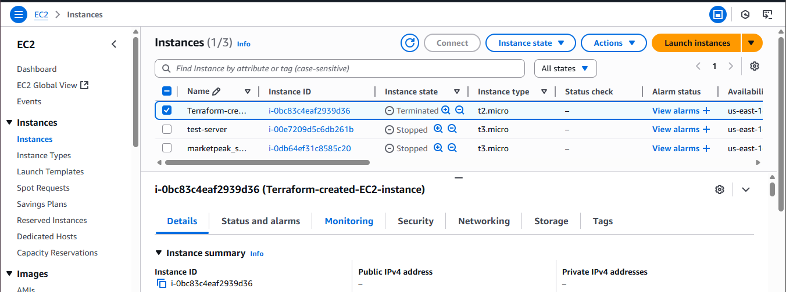
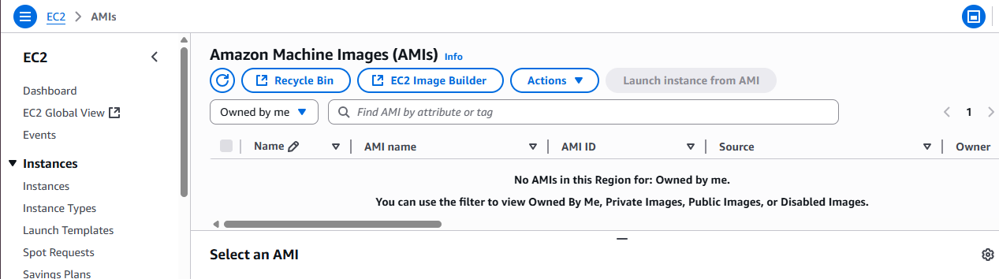

# Terraform EC2 Instance and AMI Creation

This mini project uses Terraform to automate the creation of an EC2 instance on AWS and subsequently create an Amazon Machine Image (AMI) from that instance.

## Project Overview

### Objectives
- Learn how to write basic Terraform configuration files
- Automate EC2 instance creation on AWS using Terraform
- Create an AMI from an existing EC2 instance using Infrastructure as Code

### What You'll Build
- An EC2 instance with specified configuration
- An AMI created from the EC2 instance
- Complete infrastructure automation using Terraform

## Prerequisites

This project requires you to have:

### 1. AWS Account
- Active AWS account with appropriate permissions
- Access to EC2 and AMI services
- Use this guide [here](https://docs.aws.amazon.com/accounts/latest/reference/manage-acct-creating.html)
if you do not have an account.

### 2. AWS CLI
- AWS CLI installed and configured
- Valid AWS credentials configured locally
- Use this guide [here](https://docs.aws.amazon.com/cli/latest/userguide/getting-started-install.html) if your AWS CLI is not configured yet.

### 3. Terraform
- Terraform installed on your local machine
- Use this guide [here](https://developer.hashicorp.com/terraform/install) if you do not have Terraform Installed.
- Basic understanding of HCL (HashiCorp Configuration Language)

## Project Outline

1. Confirm the Prerequisites
2. Write the Script
3. Execute the Script 
   3.1. Initialize [init] 
   3.2. Validate [validate]
   3.3. Plan [plan]
   3.4. Apply [apply]
4. Confirm Resources
5. Clean up

## Step-by-Step Implementation

### Task 1: Confirm Prerequisites

#### 1.1 Verify AWS Account Access
```bash
# Login to AWS Console to confirm account is functional
# Navigate to https://aws.amazon.com/console/
```

#### 1.2 Check AWS CLI Installation
```bash
# Verify AWS CLI is installed
aws --version

# Expected output: aws-cli/2.x.x Python/3.x.x...
```

#### 1.3 Confirm AWS CLI Configuration
```bash
# Check AWS CLI configuration
aws configure list

# Expected output showing configured credentials 
   Name                    Value             Type    Location
      ----                    -----             ----    --------
   profile                <not set>             None    None
access_key        ****************         shared-credentials-file
secret_key        ****************         shared-credentials-file
    region        ****************         *********     *******
```

#### 1.4 Test AWS Authentication
```bash
# Verify AWS CLI can authenticate
aws sts get-caller-identity

# Expected output: Account ID, User ARN, and User ID
--------------------------------------------------------------------
|                         GetCallerIdentity                        |
+--------------+----------------------------------+----------------+
|    Account   |               Arn                |    UserId      |
+--------------+----------------------------------+----------------+
| ************ | ******************************** |  ************  |
+--------------+----------------------------------+----------------+
```

#### 1.5 Verify Terraform Installation
```bash
# Check Terraform version
terraform --version

# Expected output: Terraform v1.x.x
```

### Task 2: Develop the Terraform Script

#### 2.1 Create Project Directory
```bash
# Create and navigate to project directory
mkdir terraform-ec2-ami
cd terraform-ec2-ami
```

#### 2.2 Create Main Configuration File
```bash
# Create the main Terraform file
nano main.tf
```

#### 2.3 Write Terraform Configuration
Add the following configuration to `main.tf`:

```hcl
# Configure AWS Provider
provider "aws" {
  region = "us-east-1"  # Change to your preferred AWS region
}

# Create EC2 Instance
resource "aws_instance" "my_ec2_spec" {
  ami           = "ami-0c55b159cbfafe1d0"  # Amazon Linux 2 AMI (update as needed)
  instance_type = "t2.micro"              # Free tier eligible instance type
  
  tags = {
    Name        = "Terraform-created-EC2-instance"
    Environment = "Learning"
    Project     = "Terraform-AMI-Creation"
  }
}

# Create AMI from EC2 Instance
resource "aws_ami" "my_ec2_spec_ami" {
  name               = "my-ec2-ami"
  description        = "My AMI created from my EC2 instance with Terraform script"
  source_instance_id = aws_instance.my_ec2_spec.id
  
  tags = {
    Name        = "Terraform-created-AMI"
    Environment = "Learning"
    Project     = "Terraform-AMI-Creation"
  }
}
```

### Task 3: Execute the Terraform Script

#### 3.1 Initialize Terraform
```bash
# Initialize the Terraform working directory
terraform init
```
**Expected Result:** Downloads AWS provider and initializes backend

#### 3.2 Validate Configuration
```bash
# Validate the Terraform configuration syntax
terraform validate
```
**Expected Result:** "Success! The configuration is valid."

#### 3.3 Plan the Deployment
```bash
# Create an execution plan
terraform plan
```
**Expected Result:** Shows resources to be created (1 EC2 instance, 1 AMI)

Terraform will perform the following actions:

  # aws_ami_from_instance.my_ec2_spec_ami will be created
  + resource "aws_ami_from_instance" "my_ec2_spec_ami" 

#### 3.4 Apply the Configuration
```bash
# Apply the Terraform configuration
terraform apply
```
**Actions Required:**
- Review the planned changes
- Type `yes` when prompted to confirm
- Wait for resources to be created


### Task 4: Confirm Resources

#### 4.1 Verify in AWS Console
1. **EC2 Instance:**
   - Navigate to AWS Console → EC2 → Instances
   - Confirm instance named "Terraform-created-EC2-instance" exists
   - Check instance state, type, and tags

   

2. **AMI:**
   - Navigate to AWS Console → EC2 → Images → AMIs
   - Confirm AMI named "my-ec2-ami" exists
   - Verify AMI is available and properly tagged


#### 4.2 Verify via AWS CLI
```bash
# List EC2 instances
aws ec2 describe-instances --filters "Name=tag:Name,Values=Terraform-created-EC2-instance"

# List AMIs
aws ec2 describe-images --owners self --filters "Name=name,Values=my-ec2-ami"
```

#### 4.3 Check Terraform State
```bash
# Show current Terraform state
terraform show

# List managed resources
terraform state list
```

## Script Explanation

### Provider Configuration
```hcl
provider "aws" {
  region = "us-east-1"
}
```
- Specifies AWS as the cloud provider
- Sets the deployment region (change as needed)

### EC2 Instance Resource
```hcl
resource "aws_instance" "my_ec2_spec" {
  ami           = "ami-0c55b159cbfafe1d0"
  instance_type = "t2.micro"
  tags = { ... }
}
```
- **ami**: Amazon Machine Image ID (update for your region)
- **instance_type**: EC2 instance size (t2.micro for free tier)
- **tags**: Metadata for resource identification and management

### AMI Resource
```hcl
resource "aws_ami" "my_ec2_spec_ami" {
  name               = "my-ec2-ami"
  description        = "..."
  source_instance_id = aws_instance.my_ec2_spec.id
}
```
- **name**: Unique name for the AMI
- **source_instance_id**: References the EC2 instance created above
- Creates dependency ensuring EC2 instance exists before AMI creation

## Cleanup

### Task 5: Destroy Resources
```bash
# Destroy all resources created by Terraform
terraform destroy
```

**Actions Required:**
- Review resources to be destroyed
- Type `yes` when prompted to confirm
- Wait for all resources to be deleted


**Verification:**
- Check AWS Console to confirm resources are removed
- Verify no unexpected charges on AWS billing





## Troubleshooting

### Common Issues and Solutions

#### 1. AWS Credentials Not Found
```bash
# Error: No valid credential sources found
# Solution: Configure AWS CLI
aws configure
```

#### 2. AMI ID Not Found
```bash
# Error: InvalidAMIID.NotFound
# Solution: Update AMI ID for your region
aws ec2 describe-images --owners amazon --filters "Name=name,Values=amzn2-ami-hvm-*" --query 'Images[0].ImageId'
```

#### 3. Insufficient Permissions
```bash
# Error: UnauthorizedOperation
# Solution: Ensure IAM user has required permissions:
# - EC2FullAccess or specific EC2 permissions
# - IAM permissions for role assumption if using roles
```

#### 4. Resource Already Exists
```bash
# Error: Resource already exists
# Solution: Import existing resource or use different names
terraform import aws_instance.my_ec2_spec i-1234567890abcdef0
```

## Learning Outcomes

After completing this project, you will have:
- ✅ Created infrastructure using Terraform
- ✅ Automated EC2 instance provisioning
- ✅ Generated AMIs from existing instances
- ✅ Managed infrastructure lifecycle with IaC
- ✅ Applied Terraform best practices

**Note:** Remember to always run `terraform destroy` after completing the lab to avoid unnecessary AWS charges.